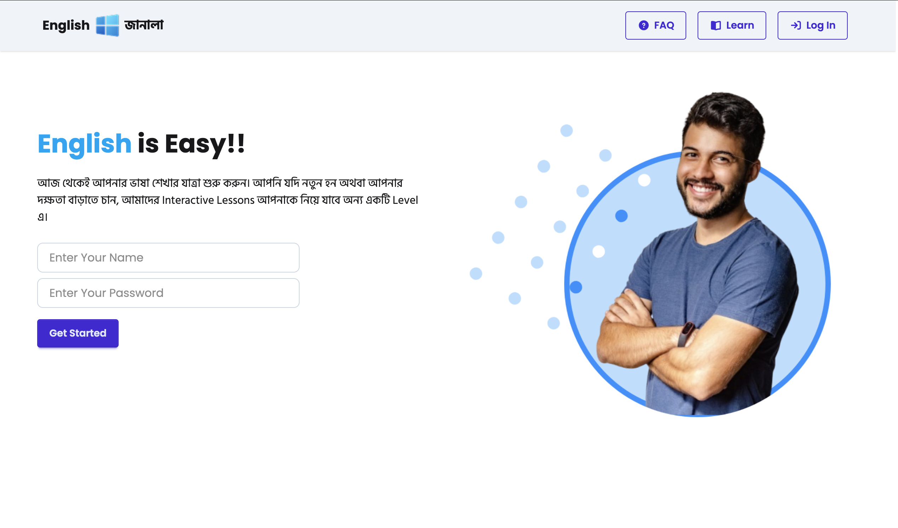
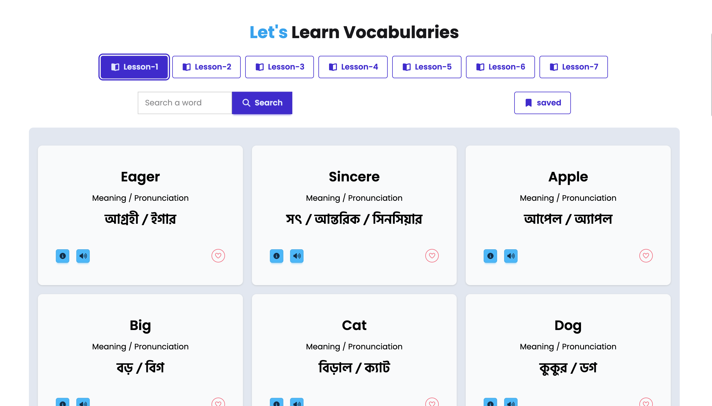
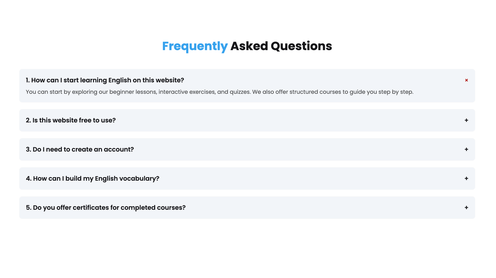

<h1 align="center">🪟 English Janala</h1>

A simple vocabulary learning app for Bengali speakers to explore English words with meanings, pronunciations, examples, and synonyms.

<a href="https://ratul-ai.github.io/English-Janala-WebApp/">🔗 Live Demo</a>

---

## ✨ Features

- Browse vocabulary by lesson levels  
- Search words across all lessons  
- View word details — meaning, example, and synonyms in a modal  
- Hear the word pronounced using the browser's Speech API  
- Save/unsave words and view them anytime in a saved list  
- Simple login flow with form validation  
- Loading spinners and error messages for a better experience 
- FAQ section with expand/collapse behavior 
- Fully responsive — works on mobile and desktop  

---

## 📸 Preview

| Home | Lessons | FAQ
|-----------|-----------|-----------|
|  |  ||

## 📚 What I learned & how I applied it here

This week I focused on three main things — **DOM manipulation**, **API integration**, and **asynchronous data fetching** , and this project is where I tried to apply everything I learned.

Instead of hardcoding data, I connected the app to a real external API to load lesson levels, vocabulary words, and word details. All of the content on the page is fetched dynamically using `fetch` and `async/await`, and then rendered into the UI.

The lesson buttons, vocabulary cards, and modal content are all generated from API responses at runtime.

For **DOM manipulation**, I used JavaScript to dynamically create and update elements — rendering cards, toggling classes, showing and hiding sections, and updating the interface without reloading the page. Features like the active lesson highlight, the login/logout flow, and the save button all update instantly based on user actions.

I also learned that doing unnecessary work can slow things down. So after fetching the full word list once for search, I stored it in a state object and reused it instead of fetching it again every time.

While building the project, I also discovered a few smaller but useful things. I learned about the native HTML `
` tag and used it to build the FAQ section, which allowed me to add expand/collapse behavior without writing any JavaScript.

I also realized that smooth scrolling navigation is surprisingly simple, just linking navbar items with `#section-id` and adding `scroll-smooth` to the `html` element.These are Small things, but satisfying.

---

## ⚙️ Challenges I ran into

**Search showing all words on empty input**, took me a moment to realize that an empty string matches everything with `.includes()`. Fixed it with a simple early return.

**Keeping the save button in sync** when a word is unsaved from the saved list, it should disappear from the list immediately. I had to track whether the user was viewing the saved list or a lesson, and re-render accordingly.

**Avoiding duplicate search results**, some words appeared across multiple lessons, so I had to deduplicate before showing search results.

---

## 🛠 Built with

HTML · Tailwind CSS v4 · DaisyUI v5 · Vanilla JavaScript · Font Awesome · Programming Hero Open API

---

## 👨‍💻 Author

**Ratul**. Currently learning web development.  

[GitHub](https://github.com/Ratul-Ai) | [Linkedin](https://www.linkedin.com/in/md-ratul242/)